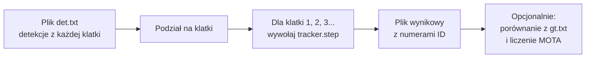
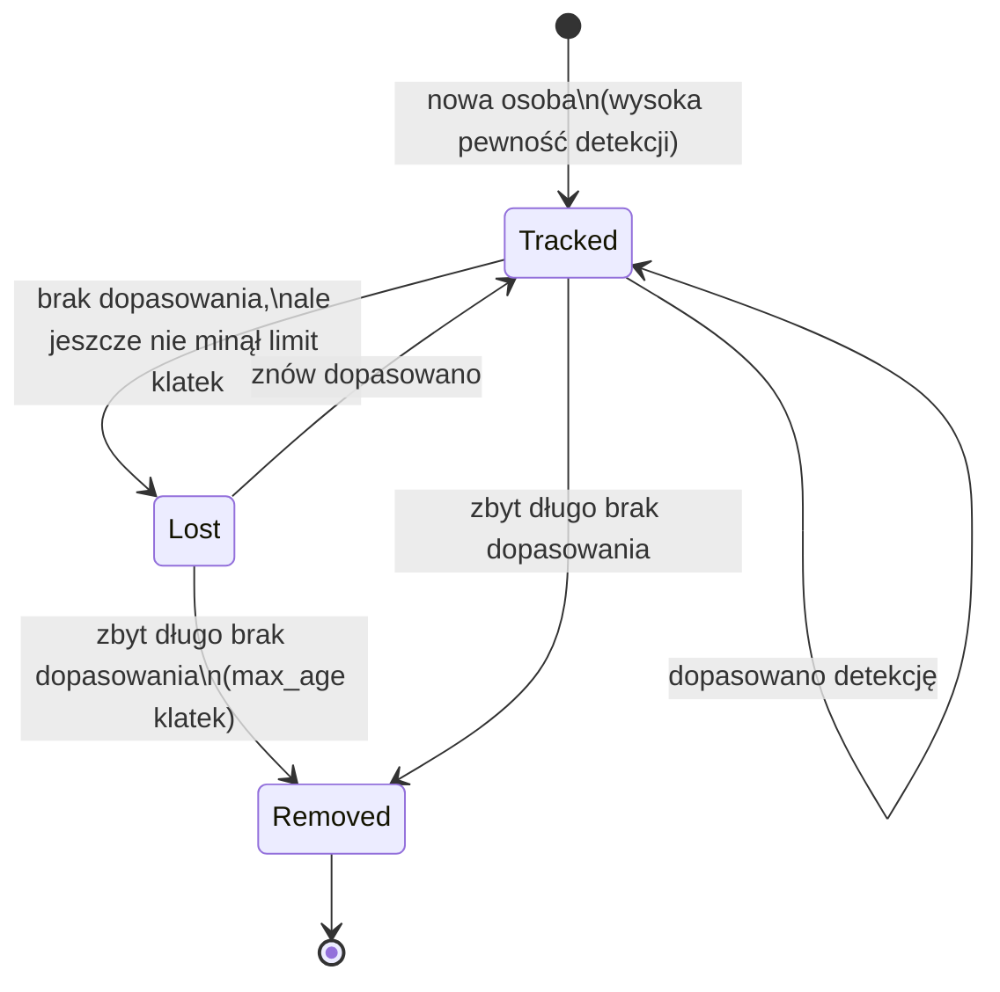
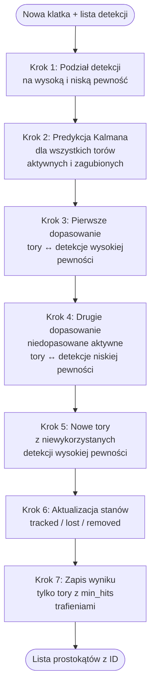

# Jak działa nasz algorytm śledzenia wielu obiektów (MOT)

Ten dokument wyjaśnia **krok po kroku**, co robi nasz program prostym językiem.

## 1. O co w ogóle chodzi?

Wyobraź sobie nagranie z monitoringu, na którym widać kilka osób. Na każdej klatce wideo **inny program** (detektor) już wcześniej wskazał: „tu jest prostokąt wokół osoby” i podał **pewność** (np. 0,87 = „jestem w 87% pewien, że to człowiek”).

**Nasz algorytm nie szuka ludzi na obrazie.** On dostaje gotowe prostokąty i ma jedno zadanie:

> **Przypisać każdej osobie stały numer (ID) i utrzymać go przez całe nagranie**, nawet gdy ktoś na chwilę zniknie za słupem albo detektor się pomyli.

Na końcu zapisujemy plik w stylu: „w klatce 42 osoba nr 3 jest w pozycji (x, y), ma szerokość i wysokość taką i taką”.

To nazywa się **śledzenie wielu obiektów** (ang. *Multi-Object Tracking*, MOT).

---

## 2. Co wchodzi do programu, a co wychodzi?

### Wejście — plik `det/det.txt`

Dla każdej klatki (numerowanej od 1) mamy wiersze:

```text
numer_klatki, -1, x, y, szerokość, wysokość, pewność
```

- **Prostokąt (bbox)** — lewy górny róg `(x, y)` oraz `szerokość` i `wysokość` w pikselach.
- **Pewność (confidence)** — liczba od 0 do 1: jak bardzo detektor ufa, że to naprawdę osoba.

### Wyjście — np. `outputs/train_predictions/MOT_01.txt`

Dla każdej klatki, dla każdej śledzonej osoby:

```text
numer_klatki, nasze_ID, x, y, szerokość, wysokość, 1, -1, -1, -1
```

- `**nasze_ID**` — numer, który **my** nadajemy i staramy się nie zmieniać (to ta sama osoba co w poprzedniej klatce).
- Ostatnie pola `1,-1,-1,-1` to wymóg formatu konkursu — zawsze tak zapisujemy.

### Dane treningowe vs testowe

- **Trening** — mamy też `gt/gt.txt` (prawdziwe odpowiedzi), żeby sprawdzić jakość (metryka MOTA).
- **Test** — jest tylko `det.txt`; odpowiedzi nie znamy, wysyłamy wynik na platformę.

---

## 3. Ogólny przebieg całego programu




**Skrypt `run_train.py`** robi dokładnie to:

1. Wczytuje wszystkie detekcje z `det.txt` dla jednej sekwencji (np. `MOT_01`).
2. Grupuje je według numeru klatki.
3. Idzie klatka po klatce (od pierwszej do ostatniej) i za każdym razem woła `**tracker.step(...)**`.
4. Zbiera wyniki i zapisuje plik `.txt`.

Cała „inteligencja” siedzi w `**tracker.step**` — to serce algorytmu.

---

## 4. Słowniczek — kilka pojęć bez żargonu


| Pojęcie                | Proste wyjaśnienie                                                                                                                                             |
| ---------------------- | -------------------------------------------------------------------------------------------------------------------------------------------------------------- |
| **Detekcja**           | Jednorazowe „tu jest prostokąt” z danej klatki, z pewnym confidence.                                                                                           |
| **Tor (track)**        | Nasza pamięć o jednej osobie: ma **ID**, ostatni prostokąt, ile razy ją widzieliśmy, czy jest „aktywna” czy „zagubiona”.                                       |
| **IoU**                | *Intersection over Union* — „jak bardzo dwa prostokąty na siebie nachodzą”. 1 = idealnie ten sam, 0 = w ogóle się nie dotykają.                                |
| **Koszt dopasowania**  | Im mniejszy, tym lepiej pasuje para (tor + detekcja). U nas: `koszt = 1 - IoU`.                                                                                |
| **Filtr Kalmana**      | Mały „kalkulator ruchu”: zgaduje, gdzie prostokąt będzie w **następnej** klatce, jeśli osoba się poruszała równomiernie.                                       |
| **Algorytm węgierski** | Sposób na **jednorazowe** przypisanie wielu torów do wielu detekcji tak, żeby **łączny koszt był jak najmniejszy** (każdy tor max jedna detekcja i odwrotnie). |


---

## 5. Stany toru — „żywy”, „zagubiony”, „usunięty”

Każda śledzona osoba (tor) jest w jednym ze stanów:




- **Tracked (śledzony)** — w tej lub poprzedniej klatce mieliśmy dla niego dopasowanie; tor jest „aktywny”.
- **Lost (zagubiony)** — w tej klatce nie znaleźliśmy detekcji, ale **jeszcze nie kasujemy** — może wróci za słupem (do `max_age` klatek czekamy).
- **Removed (usunięty)** — za długo nic nie pasowało; tor wyrzucamy z pamięci.

Dzięki stanowi **Lost** nie gubimy ID od razu, gdy detektor na jednej klatce zawiedzie.

---

## 6. Co dzieje się w **jednej klatce** — krok po kroku

Poniżej jest dokładna kolejność z pliku `mot/tracker.py`, metoda `step`. To jest **najważniejsza część** algorytmu.




### Krok 1 — Dzielimy detekcje na dwie grupy (pomysł jak w ByteTrack)

Nie wszystkie prostokąty z detektora są równie wiarygodne. Używamy **dwóch progów** z pliku `config/default.yaml`:


| Grupa              | Warunek (domyślnie)       | Sens                                                                                                            |
| ------------------ | ------------------------- | --------------------------------------------------------------------------------------------------------------- |
| **Wysoka pewność** | `confidence ≥ 0,5`        | „Prawie na pewno osoba” — z nich głównie dopasowujemy istniejące tory.                                          |
| **Niska pewność**  | `0,05 ≤ confidence < 0,5` | „Słabsze sygnały” — używamy ich **tylko w drugiej rundzie**, żeby nie stracić kogoś, kogo detektor widzi słabo. |
| **Odrzucone**      | `confidence < 0,05`       | Za słabe — w ogóle ich nie bierzemy pod uwagę w tej klatce.                                                     |


**Po co dwa progi?**  
Gdyby brać tylko „pewne” detekcje, osoba zasłonięta lub w cieniu często **znika z listy** — tor by się rozłączył i dostał **nowe ID** (to źle dla wyniku). Druga runda ratuje takie przypadki słabszymi detekcjami.

---

### Krok 2 — Filtr Kalmana: „gdzie powinna być osoba?”

Zanim cokolwiek łączymy, bierzemy **wszystkie tory aktywne i zagubione** i dla każdego wołamy `track.predict()`.

**Co robi Kalman (intuicja):**

- Pamięta nie tylko pozycję prostokąta `(x, y, szerokość, wysokość)`, ale też **szacowaną prędkość** (jak szybko się przesuwa i zmienia rozmiar).
- Na początku klatki mówi: „skoro w poprzednich klatkach ruszała się tak i tak, to **teraz** powinna być **tutaj**”.
- Dzięki temu szukamy dopasowania nie do „starego” prostokąta, tylko do **przewidzianego** — lepiej łapiemy szybki ruch.

To nie magia — to uśredniony model: „porusza się w miarę równo”. Gdy ktoś nagle skręci, jedna klatka może się pomylić, ale IoU i druga runda często to naprawią.

Implementacja: `mot/kalman.py`, stan 8 liczb: pozycja + prędkość.

---

### Krok 3 — Pierwsze dopasowanie (wysoka pewność)

**Kogo łączymy:** wszystkie tory z puli `tracked + lost` ↔ wszystkie detekcje **wysokiej** pewności.

**Jak łączymy** — funkcja `match` w `mot/association.py`:

#### 3a. Liczymy IoU (nachodzenie prostokątów)

Dla każdej pary (tor, detekcja) liczymy **IoU** między prostokątem toru (po predykcji Kalmana) a prostokątem detekcji.

- IoU blisko **1** → prostokąty prawie w tym samym miejscu → **dobra para**.
- IoU blisko **0** → daleko od siebie → **zła para**.

Z IoU robimy **koszt**: `koszt = 1 - IoU` (im mniej nachodzą, tym wyższy koszt).

Kod: `mot/iou.py` → macierz kosztów w `association.py`.

#### 3b. Algorytm węgierski — „optimalny przydział”

Mamy np. 5 torów i 7 detekcji. Chcemy **parować** tory z detekcjami tak, żeby:

- jeden tor nie dostał dwóch detekcji,
- jedna detekcja nie poszła do dwóch torów,
- **suma kosztów** była jak najmniejsza.

To klasyczny problem przypisania. Rozwiązuje go **algorytm węgierski** (w kodzie: `scipy.optimize.linear_sum_assignment`).

**Analogia:** masz 5 kurierów i 7 paczek; każdy kurier jedzie do jednej paczki; liczysz „dystans” każdej pary i wybierasz układ, gdzie łączny dystans jest najmniejszy.

#### 3c. Odrzucamy złe pary (próg kosztu)

Węgierski może teoretycznie przypisać tor do detekcji z bardzo niskim IoU. Dlatego po przypisaniu sprawdzamy:

- jeśli `koszt > first_match_cost_max` (domyślnie **0,8**, czyli IoU musi być większe niż ok. **0,2**) → **odrzucamy** tę parę; tor i detekcja zostają „niedopasowane”.

Dla **dopasowanych** par: `track.update(detekcja)` — Kalman dostaje nowy pomiar, prostokąt się poprawia, stan toru wraca na **Tracked**, licznik trafień `hits` rośnie.

---

### Krok 4 — Drugie dopasowanie (niska pewność)

**Kogo łączymy:** tylko tory, które po kroku 3:

- nadal były **Tracked** (aktywne),
- **nie** dostały detekcji wysokiej pewności,

↔ detekcje **niskiej** pewności z kroku 1.

Ten sam schemat: macierz kosztów → węgierski → próg, ale ostrzejszy: `second_match_cost_max = 0,3` (czyli IoU musi być **> 0,7** — tylko naprawdę dobre trafienia).

**Po co:** często słaba detekcja to ta sama osoba, tylko detektor był niepewny. Lepiej ją użyć niż od razu oznaczać tor jako zagubiony.

Tory już **Lost** nie uczestniczą w drugiej rundzie — tylko „świeżo niedopasowane aktywne”.

---

### Krok 5 — Tworzenie nowych torów

Detekcje **wysokiej** pewności, które **nikt nie przejął** w kroku 3, mogą oznaczać **nową osobę** w kadrze.

- Jeśli `confidence ≥ new_track_threshold` (domyślnie 0 — praktycznie każda wysoka detekcja),
- zakładamy **nowy tor** z kolejnym wolnym numerem ID (`1, 2, 3, ...`),
- startowy prostokąt z detekcji, w środku od razu nowy filtr Kalmana.

**Uwaga:** czasem to błąd (fałszywy alarm detektora) — stąd ważne progi i późniejsza ewaluacja FP (fałszywe alarmy).

---

### Krok 6 — Co z torami bez dopasowania?

**Aktywne tory (Tracked), które nadal nic nie dostały:**

- jeśli od ostatniego trafienia minęło **więcej niż `max_age` klatek** (domyślnie 5) → **Removed** (kasujemy),
- w przeciwnym razie → **Lost** (czekamy na kolejne klatki).

**Tory już Lost, które w kroku 3 znowu nic nie dostały:**

- ten sam test wieku → albo dalej **Lost**, albo **Removed**.

Na koniec klatki:

- `tracked_tracks` = wszystkie tory, które w tej klatce są **Tracked** (w tym odświeżone i nowe),
- `lost_tracks` = lista zagubionych, które jeszcze nie wygasły.

---

### Krok 7 — Co zapisujemy jako wynik tej klatki?

Nie każdy świeżo utworzony tor od razu trafia do pliku wynikowego. Musi mieć co najmniej `**min_hits`** udanych dopasowań (domyślnie **1** — czyli praktycznie od razu).

Dla każdego toru spełniającego ten warunek zwracamy:

- numer klatki,
- **ID toru**,
- aktualny prostokąt (po Kalmanie).

To trafia do pliku wynikowego.

---

## 7. Jak to wygląda w czasie — mini-przykład

Załóżmy 3 klatki i jedną osobę idącą w prawo.


| Klatka | Detekcje                       | Co robi tracker                                                                           |
| ------ | ------------------------------ | ----------------------------------------------------------------------------------------- |
| 1      | Jedna pewna detekcja           | Brak starych torów → **nowy tor ID=1**                                                    |
| 2      | Jedna pewna, trochę w prawo    | Kalman przewiduje pozycję → IoU wysokie → **to nadal ID=1**                               |
| 3      | Brak pewnej; jedna słaba (0,3) | Krok 3: brak matcha → tor mógłby być Lost; krok 4: słaba detekcja pasuje → **nadal ID=1** |


Gdyby w klatce 3 nie było żadnej detekcji (nawet słabej), tor poszedłby w **Lost**. Przez kilka kolejnych klatek Kalman „przesuwałby” prostokąt w prawo; gdy detektor wróci, węgierski może znowu połączyć — **to samo ID**.

Gdyby minęło 6 klatek bez dopasowania (`max_age=5`), tor **znika** — jeśli ta sama osoba wróci, dostanie **nowe ID** (to liczy się jako błąd IDSW przy ocenie).

---

## 8. Parametry w `config/default.yaml` — „pokrętła” algorytmu


| Parametr                    | Domyślnie | Co robi (prosto)                                                           |
| --------------------------- | --------- | -------------------------------------------------------------------------- |
| `confidence_threshold_high` | 0,5       | Od jakiej pewności detekcja jest „pewna”.                                  |
| `confidence_threshold_low`  | 0,05      | Dolna granica słabszych detekcji do drugiej rundy.                         |
| `new_track_threshold`       | 0,0       | Jak pewna musi być detekcja, żeby z niej założyć **nowy** tor.             |
| `first_match_cost_max`      | 0,8       | Jak słabe może być pierwsze dopasowanie (niższy = bardziej restrykcyjnie). |
| `second_match_cost_max`     | 0,3       | Jak słabe może być drugie dopasowanie (ostrzej — tylko mocne trafienia).   |
| `max_age`                   | 5         | Ile klatek czekamy na powrót osoby bez detekcji.                           |
| `min_hits`                  | 1         | Ile razy musimy zobaczyć tor, żeby pojawił się w wyniku.                   |


Skrypt `tune_grid` / `run_grid_search` może te liczby przeszukiwać na zbiorze treningowym, żeby poprawić **MOTA**.

---

## 9. Gdzie w kodzie co leży


| Plik                        | Rola                                                             |
| --------------------------- | ---------------------------------------------------------------- |
| `mot/tracker.py`            | Główna pętla klatki (`step`), stany torów, tworzenie i usuwanie. |
| `mot/association.py`        | Macierz kosztów, algorytm węgierski, filtrowanie par.            |
| `mot/iou.py`                | Liczenie nachodzenia prostokątów.                                |
| `mot/kalman.py`             | Predykcja i korekta pozycji.                                     |
| `mot/io.py`                 | Wczytanie `det.txt`, zapis wyniku MOT.                           |
| `scripts/run_train.py`      | Pętla po klatkach i sekwencjach treningowych.                    |
| `scripts/run_test.py`       | To samo dla danych testowych (bez gt).                           |
| `scripts/evaluate_train.py` | Porównanie z `gt.txt` i liczenie MOTA.                           |


---

## 10. Jak oceniamy jakość (MOTA) — osobno od trackera

Ewaluator (`evaluate_train.py`) **nie śledzi** — tylko **porównuje** nasz plik z prawdą (`gt.txt`).

Dla każdej klatki:

1. Bierze tylko osoby z gt oznaczone do oceny (`eval_flag=1`, `class=1`).
2. Łączy nasze prostokąty z prawdziwymi (znowu IoU + węgierski, próg IoU 0,5).
3. Liczy:
  - **FN** — w gt jest osoba, my jej nie mamy (zagubiliśmy),
  - **FP** — my mamy, w gt nie ma (halucynacja),
  - **IDSW** — prostokąt pasuje do tej samej osobi fizycznie, ale **inny numer ID** niż w poprzedniej klatce.

Wzór:

```text
MOTA = 1 - (FN + FP + IDSW) / liczba_osób_w_gt
```

Im bliżej **1**, tym lepiej. Nasz tracker jest budowany tak, żeby **minimalizować** te trzy błędy — stąd Kalman, dwa progi pewności, czekanie `max_age` i ostrożne progi kosztu.

---

## 11. Podsumowanie jednym zdaniem

**Na każdej klatce:** dzielimy detekcje na pewne i słabsze → przewidujemy pozycje znanych osób (Kalman) → optymalnie je łączymy z detekcjami (węgierski + IoU), najpierw z pewnymi, potem ratujemy słabszymi → zakładamy nowe ID dla nowych osób → stare bez dopasowania chwilowo „zagubione”, potem usuwane → zapisujemy prostokąty ze stałymi numerami.

To cały flow naszego algorytmu — bez uczenia sieci neuronowej w środku, tylko geometryczne dopasowanie, prosty model ruchu i kilka reguł zarządzania pamięcią o obiektach.

---

## 12. Inspiracje (dla ciekawskich)

- **Tracking-by-detection** — najpierw detektor, potem łączenie w czasie (nie szukamy pikseli sami).
- **ByteTrack** — pomysł **dwóch rund** dopasowania (wysoka i niska pewność).
- **SORT / DeepSORT** — typowy duet Kalman + węgierski; my używamy podobnej bazy bez modułu wyglądu (re-id po cechach wizualnych).

Jeśli chcesz zobaczyć wynik wizualnie: `python -m scripts.visualize_tracks --with-gt` rysuje prostokąty na klatkach z obrazów sekwencji.